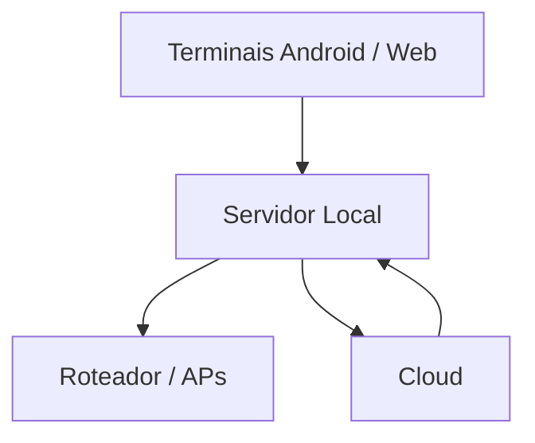
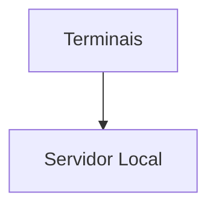

# EVENTPAY

Plataforma cashless offline-first para eventos, projetada para operar em três modos:

1. **DEMO**: execução integral em HTML/CSS/JS, hospedável no GitHub Pages.
2. **EVENTO LOCAL**: servidor dentro do evento, funcionando sem internet.
3. **CLOUD**: SaaS multi-evento e multi-cliente, com evolução natural para backend robusto.

O MVP deste repositório foi desenhado para parecer uma versão comercial inicial, já com:

- Tela de login
- Dashboards executivo e operacional
- PDV touch no estilo SmartPOS Android
- Simulação NFC e QR Code
- Recarga de carteira
- Extrato do cliente
- Fila de sincronização offline-first
- Base para PWA

## Visão do Produto

O EVENTPAY resolve a operação cashless de eventos ao centralizar:

- Identificação do participante por NFC, pulseira ou QR Code
- Recarga de créditos
- Venda touch com baixa de saldo
- Registro audível de todas as transações
- Sincronização distribuída entre terminais, servidor local e nuvem

## Arquitetura

### Frontend

- HTML5
- CSS3
- JavaScript ES6+
- Evolução planejada para React e React Native

### Backend futuro

- FastAPI
- JWT
- REST API
- WebSocket

### Banco

- PostgreSQL na nuvem
- SQLite no servidor local

### Comunicação

- REST para sincronização, gestão e relatórios
- WebSocket para estados operacionais e telemetria em tempo real

## Modos de Operação

### DEMO

O modo DEMO roda sem backend e usa:

- `localStorage` para estado mestre
- `IndexedDB` para transações e fila de sync
- Dados mockados
- Service Worker para cache e offline

### EVENTO LOCAL

Arquitetura sugerida:



Quando a internet cai:



O evento continua operando sem dependência externa.

### CLOUD

No SaaS, a solução deve suportar:

- Multi-eventos
- Multi-clientes
- Gestão centralizada
- Auditoria e trilha de sincronização
- Consolidação financeira e operacional

## Estratégia Offline First

Toda transação nasce localmente com identificadores distribuídos.

Campos de referência:

```json
{
  "transactionId": "",
  "deviceId": "",
  "terminalId": "",
  "eventId": "",
  "createdAt": "",
  "syncStatus": ""
}
```

### Status de sincronização

- `SYNCED`
- `PENDING`
- `CONFLICT`
- `FAILED`

### Fluxo

1. A venda acontece localmente.
2. O saldo é atualizado imediatamente.
3. A transação entra na fila de sincronização.
4. Quando a rede volta, o Sync Engine processa a fila.
5. Se houver divergência, o item recebe `CONFLICT` ou `FAILED`.

## Entidades

### EVENTO

- id
- nome
- dataInicio
- dataFim
- local
- status

### CLIENTE

- id
- nome
- cpf
- telefone
- email

### CARTEIRA

- id
- clienteId
- saldoAtual

### CARTAO

- id
- codigoNFC
- codigoQR
- status

### OPERADOR

- id
- nome
- login

### TERMINAL

- id
- nome
- tipo
- status

### PRODUTO

- id
- codigo
- descricao
- categoria
- valor

### VENDA

- id
- terminal
- operador
- cliente
- valor

### ITEM_VENDA

- id
- venda
- produto
- quantidade

### RECARGA

- id
- valor
- formaPagamento

### ESTORNO

- id
- motivo

### SINCRONIZACAO

- id
- status
- data

## Perfis

- Administrador
- Gerente Evento
- Caixa
- Operador PDV
- Auditoria

## Telas

- Login
- Dashboard Executivo
- Dashboard Operacional
- Cadastro Evento
- Cadastro Produtos
- Cadastro Clientes
- Cadastro Operadores
- Cadastro Terminais
- Caixa Recarga
- PDV
- Extrato Cliente
- Sincronização
- Relatórios
- Configurações

## PDV

O PDV foi desenhado para parecer uma maquininha Android:

- Botões grandes
- Interface touch
- Cartão NFC e QR simulados no modo demo
- Carrinho lateral
- Comprovante mockado
- Venda registrada com débito de saldo

## PWA

O projeto já nasce com:

- `manifest.webmanifest`
- `Service Worker`
- Cache local
- Funcionamento offline
- Instalação como aplicativo
